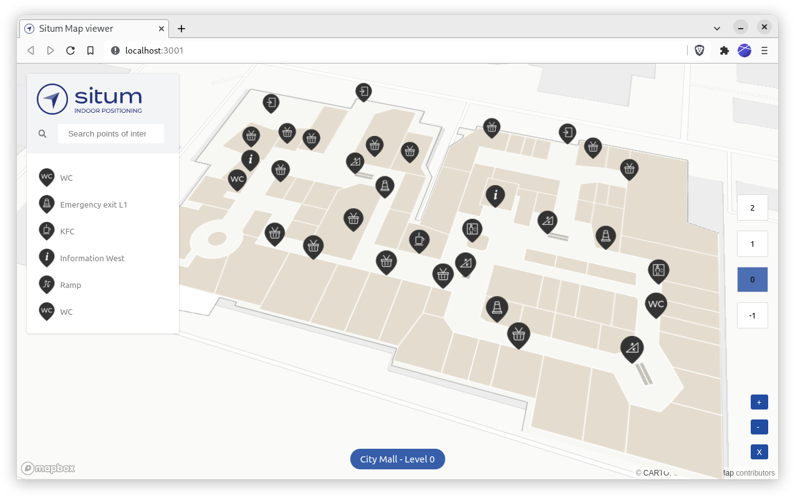

<p align="center">  <h1 align="center">Situm Web Map Viewer</h1> </p>

<p align="center" style="text-align:center">

A Map Viewer using the [SITUM](https://www.situm.com/) SDK JS to show your buildings and navigate through them in a website.

</p>

<div align="center" style="text-align:center">

[](https://opensource.org/licenses/MIT)


[](https://github.com/ellerbrock/typescript-badges/)

</div>

## What's in here

This project creates a web map viewer as shown in the image below:


It has some interesing features as a base point to develop you own custom map:

- Retrieves information such as buildings, floors, POIs and POI categories.
- Display the floorplan of the venue appropriately rotated.
- Display the POIs on top of the floorplan.
- Implement a basic Floor selector, that changes the floor to be displayed.
- Implement a basic POI selector, that centers the view on the selected POI (changing floors if required).

## Getting started

Below you can find the instructions to setup this project and run it locally

1. copy the environment file .env.development.dist to .env.development
2. change the .env.development contents with the appropriate values

```
VITE_DOMAIN="https://dashboard.situm.com"
VITE_EMAIL='your-situm-account-email'
VITE_APIKEY='your-situm-apikey'
```

you can **optionally** change the `VITE_MAPBOX_API_KEY` to display an underlying map in the viewer

Then, execute

```
npm install
npm start
```

You should see a new webpage appearing in your browser (http://localhost:3000).

## Versioning

We use [SemVer](http://semver.org/) for versioning.

Please refer to [CHANGELOG.md](CHANGELOG.md) for a list of notables changes for each version of the library.

You can also see the [tags on this repository](https://github.com/situmtech/situm-sdk-js/tags).

## Submitting Contributions

You will need to sign a Contributor License Agreement (CLA) before making a submission. [Learn more here.](https://situm.com/contributions/)

## License

This project is licensed under the MIT - see the [LICENSE.txt](LICENSE.txt) file for details.
